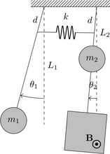
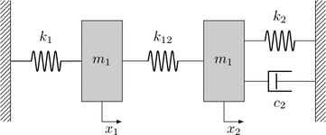

# real-valued-ep2

**Locate an EP2 for real-valued parameters.**


This script aims at finding an _exceptional point_ with real-valued parameters leading to the coalescence of _two eigenvalues_. This script implement the method proposed in [^1]
> Even, N., Nennig, B., Lefebvre, G., & Perrey-Debain, E. (2023). Experimental observation of exceptional points in coupled pendulums. arXiv preprint arXiv:2308.01089. [10.48550/arXiv.2308.01089](https://doi.org/10.48550/arXiv.2308.01089).

and applies it two coupled pendulums or to two-DoF damped spring-mass system [^2]. While EPs are relatively easy to construct by letting parameters of the model to be complex-valued (see for instance [EasterEig](https://github.com/nennigb/EasterEig) package), the novelty of this work lies in the existence of EPs with real-valued parameters.

# Description of the method

An EP corresponds to the solution of the two equations (necessary condition),

$$
    \mathbf{f} (\lambda; \mu, \nu) =
    \begin{bmatrix}
        p(\lambda; \mu, \nu) \\
        \partial_\lambda p (\lambda; \mu, \nu)
    \end{bmatrix} = \mathbf{0},
$$

where $\lambda$ is the eigenvalue which is generally complex-valued and $\mu$ and $\nu$ are two real parameters. We may assume that the previous system is polynomial with respect to the parameters (which is the case here). If we imagine for the moment that only a single parameter is available, then Bézout theorem states that discrete solutions exist if the latter is allowed to be complex-valued.

When two complex-valued parameters are available, solutions belong to a one-dimensional continuous domain. The difficulty arises when both parameters are restricted to be real-valued. A simple method is to define the variable  $\mathbf{x} (\nu) = [\lambda(\nu), \mu(\nu)]^{\mathrm{T}}$ which  implicitly depends on the free parameter $\nu$. The first step is to consider an initial guess $\nu_{\mathrm{ig}}$ and find a solution $`\mathbf{x}_{\mathrm{ig}}=\mathbf{x} (\nu_{\mathrm{ig}})`$.


The second step is to track the solution path, while keeping $\nu$ real-valued, until a real-valued solution $\mu(\nu)$ is found.
Instead of solving the non-linear system successively, the problem is recast into an ODE and solved by integration starting from the initial solution $\mathbf{x}_{\mathrm{ig}}$.
Along the solution path, we must have

$$
        \frac{\mathrm{d}}{\mathrm{d} \nu} \mathbf{f}(\mathbf{x} (\nu), \nu)  = \mathbf{0}.
$$

Applying the multivariate chain rule yields the first-order ODE for the solution $\mathbf{x}$:

$$
    \frac{\mathrm{d} \mathbf{x}}{\mathrm{d} \nu} = - \mathbf{J}_{\mathbf{f}}^{-1} (\mathbf{x}, \nu) \frac{\partial \mathbf{f}}{\partial \nu} (\mathbf{x}, \nu),
$$

where $\mathbf{J}_{\mathbf{f}} = \frac{\partial \mathbf{f}}{\partial \mathbf{x}}$ is the Jacobian matrix.
All derivatives involved are explicitly computed from the equation of motion.
This evolution problem is solved numerically with the Runge-Kutta method.
 Here, `pypolsys` python package is used to solve the multivariate polynomial system with the homotopy method. It is noteworthy that the characteristic polynomials may become ill-conditioned in the vicinity of EP when the number of degrees of freedom gets large. In this case, the main steps can be conserved when working on a subset of the eigenvalues [^3] [^4].


## Installation

First, install the dependencies using `pip` or other package manager (you may consider to use virtual environment).
```
pip install numpy scipy matplotlib sympy
```
Then install [`pypolsys`](https://github.com/nennigb/pypolsys). There is no wheel for this package and the installation requires a fortran compiler (see `pypolsys` README for more details about install).
```
pip install pypolsys
```
Note that on some systems (like ubuntu), `python3` or `pip3` should be use to call python v3.x.


## Running the examples
The main algorithm are implemented in the `real_valued_ep2.py` file. Finding the real-valued EPs and the associated eigenvalue is done **numerically** but the parametric eigenvalue problem and its characteristic polynomial is built using `sympy` symbolic computation facility for convenience.

### Pendulums
This example is implemented in `coupled_pendulums.py`. Here we suppose the parameters are the length and the damping coefficient of the second pendulum, `l2` and `c2` respectively. First the complex EP [λ(l2), c2(l2)] is found by fixing `l2=1` (ie the ν parameter), then the EP is tracked by changing `l2` until `c2` (ie the μ parameter) is real-valued up to the given precision.



### Two-DoF damped spring-mass system
This example is implemented in `coupled_spring-mass_systems.py`. Here we suppose the parameters are the stiffness and the damping coefficient of the second spring-mass system, `k2` and `c2` respectively. First the complex EP [λ(k2), c2(k2)] is found by fixing `k2=1` (ie the ν parameter), then the EP is tracked by changing `k2` until `c2` (ie the μ parameter) is real-valued up to the given precision.



## Citing

If you are using `real-valued-ep2` in your scientific research, please cite

> Even, N., Nennig, B., Lefebvre, G., & Perrey-Debain, E. (2023). Experimental observation of exceptional points in coupled pendulums. arXiv preprint arXiv:2308.01089. [10.48550/arXiv.2308.01089](https://doi.org/10.48550/arXiv.2308.01089).

BibTex:
```bibtex
@article{10.48550/arXiv.2308.01089,
  title={Experimental observation of exceptional points in coupled pendulums},
  author={Even, N. and Nennig, B. and Lefebvre, G. and Perrey-Debain, E.},
  journal={arXiv preprint arXiv:2308.01089},
  year={2023}
}

```

## References

[^1]: Even, N., Nennig, B., Lefebvre, G., & Perrey-Debain, E. (2023). Experimental observation of exceptional points in coupled pendulums. arXiv preprint arXiv:2308.01089. [10.48550/arXiv.2308.01089](https://doi.org/10.48550/arXiv.2308.01089).

[^2]: J.-W. Ryu, W.-S. Son, D.-U. Hwang, S.-Y. Lee, S. W. Kim, Exceptional points in coupled dissipative dynamical systems, Physical Review E 91 (2015) 052910. [doi:10.1103/PhysRevE.91.052910](https://doi.org/10.1103/PhysRevE.91.052910).

[^3]: M. Ghienne, B. Nennig, Beyond the limitations of perturbation methods for real random eigenvalue problems using Exceptional Points and analytic continuation, Journal of Sound and Vibration 480 (2020) 115398. [doi:10.1016/j.jsv. 2020.115398](https://doi.org/10.1016/j.jsv.2020.115398).

[^4]: A. A. Mailybaev, Computation of multiple eigenvalues and generalized eigenvectors for matrices dependent on parameters, Numerical Linear Algebra with Applications 13 (5) (2006) 419–436. [doi:10.1002/nla.471](https://doi.org/10.1002/nla.471).

## License

`real-valued-ep2` is free software: you can redistribute it and/or modify it under the terms of the GNU General Public License as published by the Free Software Foundation, either version 3 of the License, or (at your option) any later version.
`real-valued-ep2` is distributed in the hope that it will be useful, but WITHOUT ANY WARRANTY; without even the implied warranty of MERCHANTABILITY or FITNESS FOR A PARTICULAR PURPOSE. See the GNU General Public License for more details.

You should have received a copy of the GNU General Public License along with `real-valued-ep2`.  If not, see <https://www.gnu.org/licenses/>.

